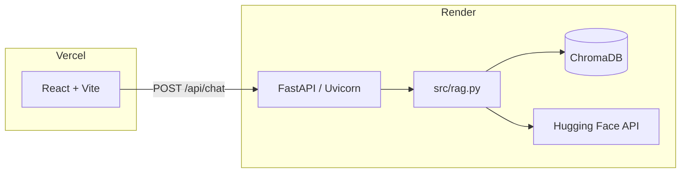

# Nour CV ChatBot

[](https://fastapi.tiangolo.com/)
[](https://react.dev/)
[](https://www.trychroma.com/)
[](https://huggingface.co/)

**RAG-powered resume assistant:** ask questions in natural language; answers are grounded in `data/resume.txt` via **ChromaDB** retrieval and **Hugging Face Inference** generation.

> Optional: add a short ScreenToGif or Loom clip here showing the chat UI.

## Architecture



## Tech stack

| Layer | Stack |
|--------|--------|
| Frontend | React 18, Vite 5, editorial UI (DM Serif Display + DM Mono) |
| Backend | FastAPI, Uvicorn, Pydantic, slowapi rate limiting |
| RAG | ChromaDB (persistent), default embeddings |
| LLM | Hugging Face Inference API (`HF_TOKEN`) |

## Local setup (3 commands)

```powershell
cd Nour_CV_ChatBot
python -m venv .venv && .\.venv\Scripts\Activate.ps1 && pip install -r requirements.txt
copy .env.example .env
```

Edit `.env`: set **`HF_TOKEN`**, then:

```powershell
python -m src.ingest
uvicorn src.api:app --reload --port 8000
```

In another terminal:

```powershell
cd frontend
npm install
npm run dev
```

Open **http://localhost:5173** — Vite proxies **`/api`** to **http://127.0.0.1:8000**.

## Environment variables

| Variable | Purpose |
|----------|---------|
| `HF_TOKEN` | Hugging Face API token (required for answers) |
| `HF_LLM_MODEL` | Optional model override |
| `RAG_TEMPERATURE` | Sampling temperature (default ~0.38 in code) |
| `ALLOWED_ORIGINS` | Comma-separated CORS origins (e.g. your Vercel URL) |
| `AUTO_INGEST_ON_STARTUP` | `true` on Render to build Chroma index if missing |
| `VITE_API_BASE_URL` | **Frontend build:** absolute URL of the API (e.g. `https://your-api.onrender.com`) — **no** trailing slash |

## Deploy

### Frontend (Vercel)

1. Root directory: **`frontend`** (or monorepo subfolder with same).
2. Build: **`npm run build`** — output **`dist`**.
3. Env: **`VITE_API_BASE_URL`** = your Render API origin (example: `https://nour-cv-api.onrender.com`).

### Backend (Render)

1. Start command: **`uvicorn src.api:app --host 0.0.0.0 --port $PORT`**
2. Set **`HF_TOKEN`**, **`ALLOWED_ORIGINS`** (your Vercel URL), optional **`HF_LLM_MODEL`**, **`RAG_TEMPERATURE`**, **`AUTO_INGEST_ON_STARTUP=true`**
3. Ensure **`data/resume.txt`** is in the deploy artifact (repo includes it).

### API contract

`POST /api/chat` — JSON `{"message": "...", "k": 6}`

Response includes **`reply`**, **`response`** (same text), **`answer`** (legacy), **`sources`** (file labels), **`sources_used`** (chunk count).

`GET /api/health` — `{"status":"ok","index_ready":bool}`

## CLI utilities

- **`python -m src.ingest`** — rebuild vector index from `data/resume.txt`
- **`python -m src.chat`** — terminal chat against the same RAG pipeline
- **`python -m src.retrieve "your question"`** — inspect retrieved chunks only

## License

Personal portfolio project — adjust as you prefer.
